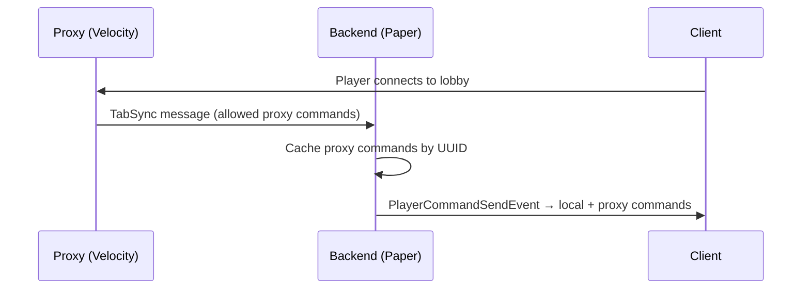

# Cross-Server Setup

When CommandGuard is installed on both the proxy and backend servers, the proxy pushes its allowed command list to each backend via plugin messaging (**TabSync**). This ensures players see a unified tab-complete list that includes both proxy commands and backend commands.

## How TabSync Works



## Setup

### 1. Proxy config (`velocity-config.yml` or `bungee-config.yml`)

```yaml
is_network: true

tab:
  default:
    priority: 0
    commands:
      - "/hub"
      - "/server"
      - "/skin"
```

### 2. Backend config (`config.yml`)

```yaml
is_network: true

tab:
  default:
    priority: 0
    commands: []   # proxy commands are added automatically via TabSync
```

:::info
Each layer manages its own commands independently:
- **Proxy** manages proxy plugin commands (`/hub`, `/server`, `/skin`...)
- **Backend** manages backend plugin commands (`/home`, `/spawn`...)
- TabSync adds proxy commands on top of backend commands in the client's tab list
:::

## Updating After Config Change

After editing the proxy config:
```
/cgv reload
```
This reloads the config **and** pushes TabSync to all online players immediately — no relog needed.

After editing the backend config:
```
/cg reload
```

## Force-Update a Single Player

```
/cgv updategroup <player>
/cg updategroup <player>
```
